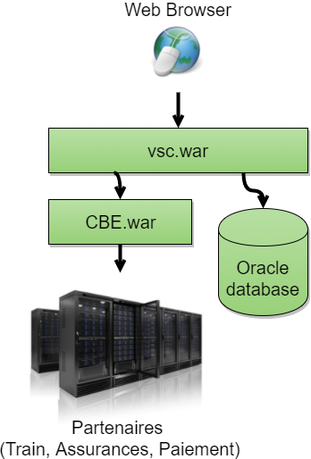

<!-- .element style="border: 0; background: None; box-shadow: None" -->

note: Je vous parler de cette page: 
Ceci est la page de paiement du site vsc. c'est un peu la partie emergée de l'iceberg du domaine paiement qui nous concerne ce soir. 

===

## Architecture existante

<!-- .element style="border: 0; background: None; box-shadow: None" -->

note: on a ce qu'on appelle un gros code legacy.
Ici, tout le code est placé dans une seule application. Cette application est responsable de tout le métier de la vente de billet de train.
Il s'agit d'une application historique (2001 la naissance quand même) qui est en train de devenir impossible a faire évoluer: on corrige d'un côté ça casse de l'autre...exemple du passage à Oui.

===

## Douleurs 

* une seule application
* de multiple intervenants
* le run de la fonction de paiement ne repose que sur une seule personne sachante au bord du burn out
* le build est déporté sur une équipe dont ce n'est pas l'unique responsabilité (check that)
* des problèmes en production que le support a du mal à traiter.

---

# Le besoin

===

## Y voir plus clair

* le metier souhaite reprendre la main sur le paiement
* on souhaite améliorer la traçabilité des évenements liés aux paiements

note: actuellement, le metier doit demander aux developpeurs de lui expliquer comment fonctionne le paiement
ce n'est pas la bonne manière de faire. On veut rendre la connaissance au metier => solution: le DDD
Nous avons également des problèmes de traçabilité du fonctionnement en prod => solution: l'Event Sourcing. 

---

# Comment découper ce legacy ?

* le modèle Feature Team
* le DDD Stratégique

note: 
disclaimer: c'est moi qui fait les interprétations des concepts, c'est pas un truc qu'on m'a expliqué mais une perception de ma part.
comment adresser le problème à la fois technique et organisationnel ?

===

## Le DDD "Stratégique"

* travail d'urbaniste
* recherche de "bounded context"

note: le ddd strategique est un outil qui va être utilisé au niveau du système d'information de l'entreprise, ou au moins sur l'ensemble du produit (dans le cas de VSC).
l'objectif est de définir des domaines fonctionels, les "bounded contexts"

===

# Qu'est ce qu'un bounded context ?

* notre périmètre de travail
* celui pour lequel un mot aura le même sens pour deux personnes différentes

note: par exemple, un code promo n'aura pas le même sens s'il est utilisé dans le cadre d'un paiement ou d'une vente..

===

le bounded context est lié à la culture d'entreprise

* une app == une équipe == un bounded context
-> efficacité.

note: La notion de bounded context n'est pas absolue, elle est valable dans la culture générale de l'entreprise. Ainsi, on aura
quelque chose d'efficace quand on a une équipe == une application == un bounded context.

---

# Le Bounded Context Paiement

note: Je vais maintenant parler de notre contenu.
L'analyse de notre bounded context va nous permetre d'avancer sur la conception de notre application

===

# Une transaction ?

> "Une opération financière est un événement contractuel d'achat ou de vente pour échanger un actif contre paiement." 
> --[Wikipedia](https://fr.wikipedia.org/w/index.php?title=Transaction_financière)

note: Dans notre appli legacy, il y a une notion de transaction. 
Ceci ne s'applique pas pour notre bounded context: on parle de paiement, pas de transaction. 
La transaction est l'échange d'un bien contre une valeur (de l'argent)
d'après notre définition, interne à l'entreprise, nous devons uniquement nous occuper de la phase qui correspond au paiement:
récupération de l'argent, et non pas à la phase qui consiste à livrer le bien: c'est ce qu'on appelle la finalisation.
C'est un autre context. 

===

### Le paiement chez VSC/Oui.sncf

* Fortement lié à la sncf                                          
* Problématique de reconciliation comptable                        <!-- .element: class="fragment" -->
* Différents partenaire en fonction des moyen de paiement          <!-- .element: class="fragment" -->
* Problématique de sécurisation des cartes bancaires               <!-- .element: class="fragment" -->
* Problématique liée à la gestion de la fraude.                    <!-- .element: class="fragment" -->

note:
Le paiement n'est pas si simple qu'il y parait: C'est la sncf qui encaisse l'argent, pas oui.sncf/vsc
On utilise Atos pour la carte bancaire et un autre système pour paypal
On utilise un partenaire de scoring pour la gestion de la fraude
On a tout un backoffice à alimenter avec les flux financiers

---

# Design de l'application

===

# Technique

* le DDD "Tactique"
* entité, service, value objects, etc.

note: 
pas de domaine anémique etc.

